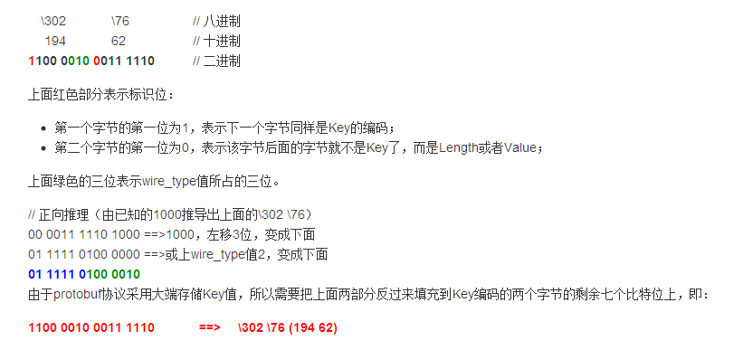

protobuf的message中有很多字段,每个字段的格式为:
修饰符 字段类型 字段名 = 域号;
在序列化时,protobuf按照TLV的格式序列化每一个字段,T即Tag,也叫Key;V是该字段对应的值v
省略。
序列化后的Value是按原样保存到字符串或者文件中,Key按照一定的转换条件保存起来,序列化后的
message中字段后面的域号与字段类型来转换。转换公式如下:

> (field_number << 3) | wire_type

wire_type与类型的对应关系表:


wire_type | meaning |  
-|-|-
0 | Vaint | int32、int64、uint32、uint64、sint32、sint64、bool、enum |
1 | 64-bit | fixed、sfixed64、double |
2 | Length-delimi | string、bytes、embedded、messages、packed repeated fields |
3 | Start group | Groups(deprecated) |
4 | End group | Groups(deprecated) |
5 | 32-bit | fixed32、sfixed32、float |


> 　As you can see, each field in the message definition has a unique numbered tag. These tags are used to identify your fields in the message binary format, and should not be changed once your message type is in use. Note that tags with values in the range 1 through 15 take one byte to encode. Tags in the range 16 through 2047 take two bytes. So you should reserve the tags 1 through 15 for very frequently occurring message elements. Remember to leave some room for frequently occurring elements that might be added in the future.

上面一段话是来自Google Protobuf Documents，上面有几个信息需要注意的地方：
protobuf协议使用二进制格式表示Key字段；对value而言，不同的类型采用的编码方式也不同，如果是整型，采用二进制表示；如果是字符，会直接原样写入文件或者字符串（即不编码）。由于刚开始接触protobuf协议，我也在学习中，下面我会给出一个例子，对于其他一些类型的编码方式，可以仿照这个例子自己实验一下。
**（这个例子主要是讲述Key的编码方式）**

上面说过，对于message中的每一个域，都对应一个域号。protobuf规定：

- 如果域号在[1，15]范围内，会使用一个字节表示Key；
- 如果域号大于等于16，会使用两个字节表示Key；

Key编码过后，该字节的第一个比特位表示之后的一个字节是否与当前这个字节有关:

- 如果第一个比特位为1，表示有关，即连续两个字节都是Key的编码；
- 如果第一个比特位为0，表示Key的编码只有当前一个字节，后面的字节是Length或者Value；

> 结合公式 （field_number << 3）| wire_type ，如果域号大于等于16，两个字节共16位，去掉移位的3位，去掉两个字节中第一个比特位，总共16个比特位只有16-5==11个比特位用来表示Key，所以Key的域号要小于2^11== 2048


## Protobuf Example

```proto
message Person {
    required string id = 1;
    required name = 2;
    required addr = 3;

    required test = 1000;
}
```

使用protoc编译后，生成两个文件：

```shell
protoc -I=. –cpp_out=. person.proto
```

建立一个Person对象: 属性为

```
id = 111

name = China

addr = Asia

test = ttttt

# 打印出序列化后的结果为：

'\n\003\061\061\061\022\005China\032\004\Asia\302\005ttttt'

```

‘\n’是id字段的Key，后面的\003（八进制）表示id字段的值长度为3

**key的域号不超过15的序列化解析：**

因为id字段的域号为1，是小于15的，所以id字段的Key序列化要占1个字节的空间，00000001左移3位变成 00001000，因为string的wire_type值是2，所以00001000再或上2，变成00001010，就是十进制的10，即字符’\n’。下面的字段如果域号不超过15，解析同id字段。
后面连续3个’\61’（八进制）即字符’1’；
同样\022\005是name字段的key和value长度，后面是name字段的值；
\032\004是addr字段的key和value长度；

最后，\302>\005是test字段的Key和Value长度；

**key的域号大于15的序列化解析：**

由于CSDN编辑器不支持CSS格式，没有办法标记下面的解析内容的颜色，只有放一个图片上去了 ^_^;
下面图片中的\76就是\302后面的‘>’字符的八进制表示，\302与>共同组成最后一个字段的Key的表示（因为最后一个字段test的域号1000大于15，所以需要占两个字节表示Key）

